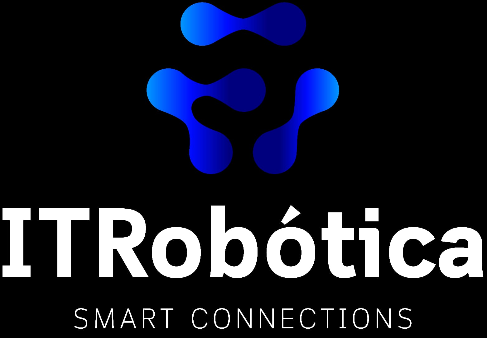

# RFID-Ubidots-Python
Código Arduino faz envio dados para Ubidots que pode ser puxados por uma API através de um código em Python

## Começo (Arduino)

Deve ser utilizado algum micro-controlador que conecta a rede via WI-FI, após isso basta abrir o arquivo .ino dentro da pasta ubidots-rfid

Para utilizar o código é necessário instalaçã das seguintes bibliotecas 

-UbidotsConnectMQTT (esp32-mqtt-main)
-MFC522-1.4.10
-SPI
-WIRE

-Trocar os dados de rede Wi-Fi
``const char *WIFI_SSID = "XXXXXXXX";      // Put here your Wi-Fi SSID``
``const char *WIFI_PASS = "XXXXXXXX";      // Put here your Wi-Fi password``

-Após a iniciar o código, é necessário trocar o **TOKEN** na ln16 do código 
``const char *UBIDOTS_TOKEN = "BBFF-ze3jXoYE4FNtWXJUdfbnSlQbrnldMJ";``

Após isso pode iniciar o código, se o **TOKEN** e a questões WIFI estiverem corretos podem, o código irá mandar diretamente para os servidores da UBIDOT 

## Backend (Python)

Para poder poder puxar os dados da Ubidots para outros projetos é necessário realizar uma conexão com a API gerada pelo usuário da conta do serviço, no caso a API do UBIDOTS pode ser encontrado no site ao lado do TOKEN 

Antes de começo de dados é necessário realizar a instalação da módulo do Ubidots no interpretador python, para instalar é bem simples, basta realizar o seguinte comando

``pip install ubidots``

Após a instalação basta realizar puxar os dados no código com importação com ``from ubidots import ApiClient`` e em seguinte basta realizar leitura dos dados conforme a [API](https://github.com/ubidots/ubidots-python), código na pasta puxa o ultimo valor de um sensor criado no pelo microntrolador.